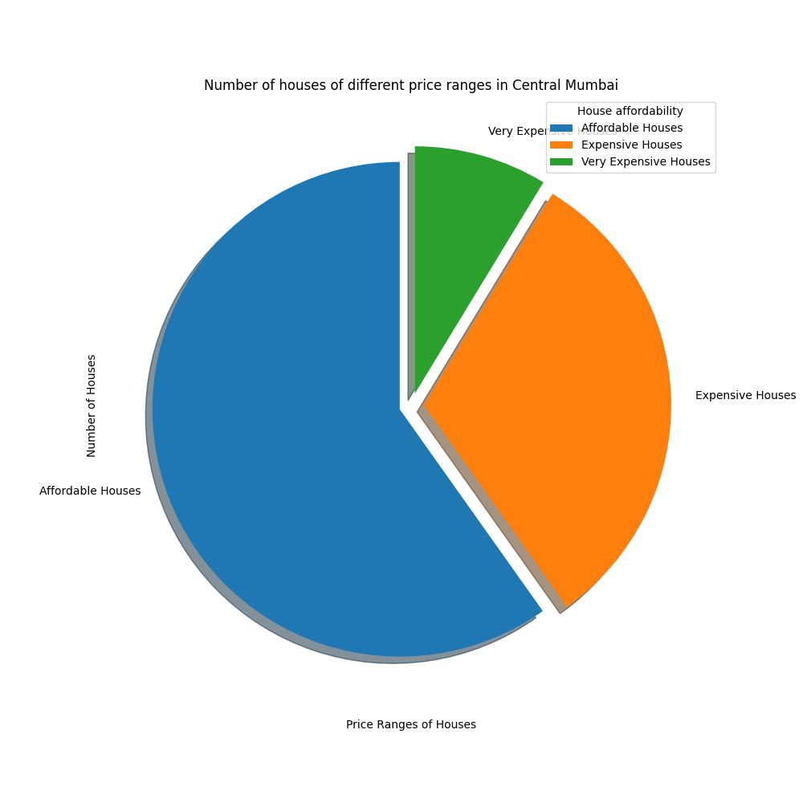
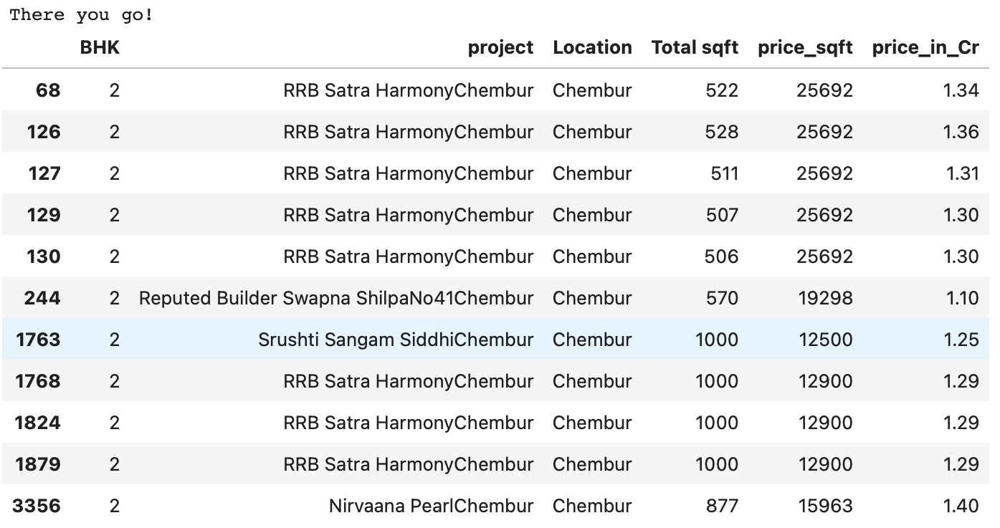

# Housing Price Estimator for Mumbai
Built a Housing Price Predictor for Mumbai using a Machine Learning model by analysing and visualizing the data in different regions of Mumbai and employing various ML models

## Author - Omkar Nitsure
Email - omkarnitsure2003@gmail.com  
github profile - https://github.com/omkarnitsureiitb  

### Collaborators
Ojas Karanjkar - https://github.com/Ojas1905  
Hitaansh Shah - https://github.com/Hitaansh04   

The data used for analysis and prediction can be found [here](house_price_mumbai.csv)  
For the major part, I have analysed the data by employing various data visualisation techniques and splitting the entire data into smaller dataframes based on many different criterias.

## Data and preprocessing
The dataset that was used had **3980 rows and 7 columns** where the features available were - **Project Name, Location, Total are in Sqft, Price per sqft and the total price of the house**. As basic preprocessing steps, redundant columns were removed and wrong feature names were corrected. The numeric values were rounded off for better visualization and crisp idea. I also made different smaller DataFrames to separately and closely analyse smaller groups.

## Data visualisation
The following bar-graphs show the average prices and average areas of houses with specified number of BHKs in Mumbai  

    <table>
	    <tr>
    	    <td style="padding:10px">
        	    
      	    </td>
            <td style="padding:10px">
            	
            </td>
        </tr>
    </table>

The following bar-graphs tell us the number of houses of different sizes and their price wise criterias.

    <table>
	    <tr>
    	    <td style="padding:10px">
        	    
      	    </td>
            <td style="padding:10px">
            	
            </td>
        </tr>
    </table>

The following pie-chart tells us the relative distribution of different price ranges in **Harbour and Central** areas of Mumbai.

    <table>
	    <tr>
    	    <td style="padding:10px">
        	    
      	    </td>
            <td style="padding:10px">
            	
            </td>
        </tr>
    </table>

I further broke down these bigger regions of Mumbai into smaller areas for deeper understanding of the distribution of prices. Two such examples are given below -

    <table>
	    <tr>
    	    <td style="padding:10px">
        	    
      	    </td>
            <td style="padding:10px">
            	
            </td>
        </tr>
    </table>

Much more **Data Analysis and Visualisation** is done and it can be found [here](Plots)

## User Interactive Interface
I have also coded a **user interface** which rather than predicting anything allows the user to **shortlist** houses based on various criteria and have a look at all the available houses which meet his criteria.  
The criteria used are as follows -  
**1. Region**  
**2. Number of BHKs**  
**3. Budget(Maximum allowed total price of the house)**  
The code for this **interface** looks like this -  
  
One example **output** for **Region - Chembur, Number of BHKs - 2, Budget - 1.5Cr** is given below -   

